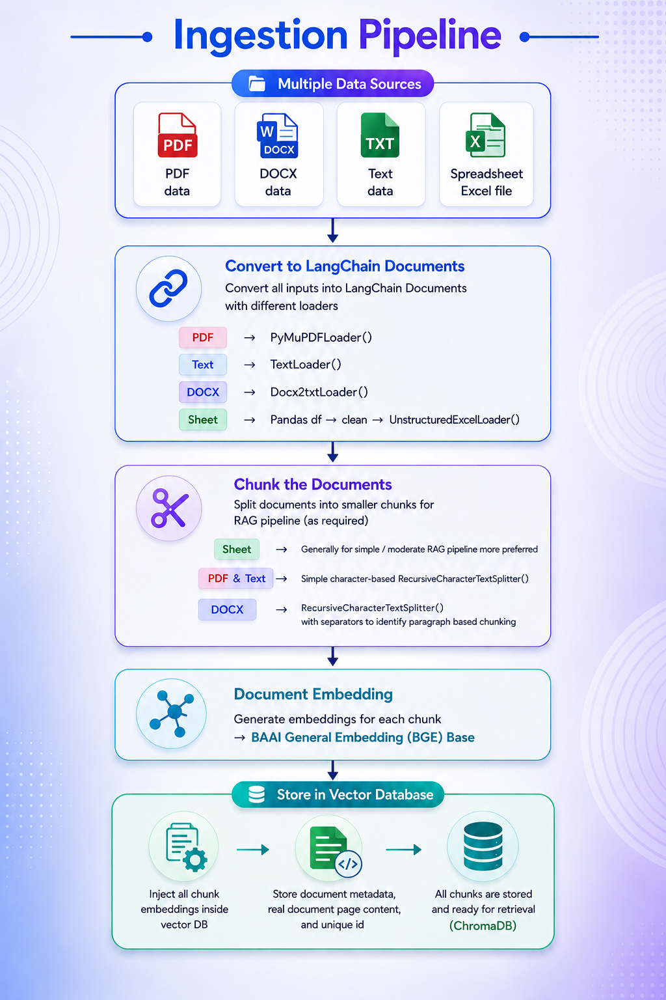
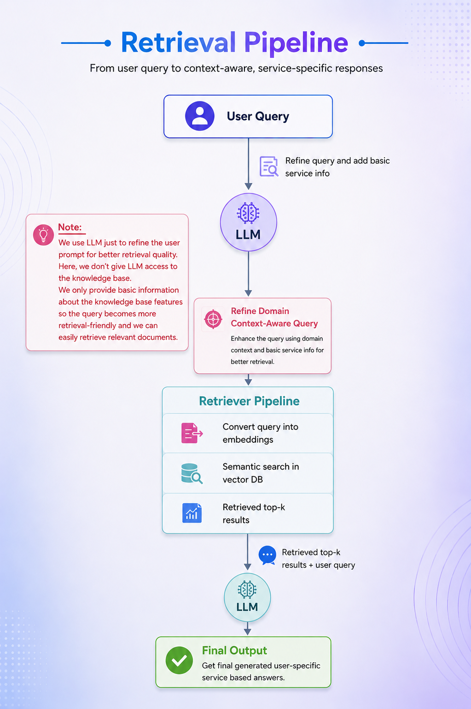

# 🍲 VillageTaste Foods — Modular RAG Chatbot System

A domain-specific **Retrieval-Augmented Generation (RAG)** chatbot system designed for **VillageTaste Foods** to provide intelligent, context-aware, and service-specific responses using company knowledge documents.

This project demonstrates how modern AI systems can combine:

- Large Language Models (LLMs)
- Semantic Search
- Vector Databases
- Embedding Models
- Retrieval Pipelines

to build reliable business-focused AI assistants.

---

# 📌 What is RAG?

## Retrieval-Augmented Generation (RAG)

RAG is an AI architecture that combines:

1. **Retrieval**  
   → Fetch relevant information from external knowledge sources

2. **Generation**  
   → Use an LLM to generate accurate and context-aware responses

Instead of relying only on pretrained knowledge, RAG systems can access custom business data such as:

- PDFs
- DOCX files
- Text documents
- Excel sheets
- Company manuals
- FAQs
- Product catalogs etc.

This helps reduce hallucination and improves response accuracy.

---

# ❓ Why This Project?

Traditional food businesses often have:

- Product catalogs
- Service details
- Festival offers
- Ordering instructions
- Ingredient information
- Customer FAQs

But customers usually need human support to access this information.

This project solves that problem by building an AI assistant that can:

- Understand user queries
- Retrieve relevant company information
- Generate intelligent responses
- Provide domain-specific assistance

for the **VillageTaste Foods** business ecosystem.

---

# 🧠 RAG Architecture Used

This project combines multiple RAG design concepts.

## ✅ Modular RAG Architecture

The entire pipeline is divided into reusable modules:

- ingestion
- chunking
- embeddings
- retrieval
- response generation

This makes the codebase scalable and maintainable.

---

## ✅ Domain-Specific RAG

The chatbot is focused only on:

- VillageTaste Foods
- Traditional food products
- Company services
- Recipes
- Customer support information

This improves retrieval precision and answer quality.

---

## ✅ Semantic Search RAG

The system uses embeddings and vector similarity search to retrieve semantically relevant documents instead of keyword matching.

---

## ✅ Query-Refinement RAG

Before retrieval, user queries are refined using an LLM to improve retrieval quality and context awareness.

---

# 🏗️ System Architecture Overview

# 1️⃣ Ingestion Pipeline



The ingestion pipeline converts multiple document formats into vector-searchable knowledge chunks.

---

## 🔹 Supported Data Sources

The system supports:

- PDF files
- DOCX documents
- TXT files
- Excel spreadsheets

---

## 🔹 Document Conversion

Different loaders are used to convert raw documents into LangChain document objects.

### Examples

```python
PyMuPDFLoader()
TextLoader()
Docx2txtLoader()
UnstructuredExcelLoader()
```

Using LangChain documents helps standardize all data into a common format for downstream processing.

---

## 🔹 Smart Chunking Strategy

Chunking is one of the most important parts of a RAG pipeline.

Different document types require different chunking approaches.

### PDFs / DOCX

Used:
- paragraph-aware chunking
- separator-aware splitting

### TXT Files

Used:
- lightweight text splitting

### Excel Sheets

Used:
- row-wise chunking

This improves retrieval precision significantly.

---

## 🔹 Embedding Generation

The system converts document chunks into embeddings using:

```python
BAAI/bge-base-en-v1.5
```

### Why BGE?

Initially, sentence-transformer embeddings were tested, but retrieval quality was not sufficiently accurate for this domain.

BGE embeddings provided:

- better semantic understanding
- improved retrieval quality
- faster similarity matching
- more accurate context search

---

## 🔹 Vector Database Storage

All embeddings are stored in:

```python
ChromaDB
```

Stored data includes:

- chunk embeddings
- document content
- metadata
- unique identifiers

This enables efficient semantic retrieval.

---

# 2️⃣ Retrieval Pipeline



The retrieval pipeline converts user queries into context-aware responses.

---

## 🔹 User Query

The user submits a natural language question.

### Example

```text
Which homemade snacks are available?
```

---

## 🔹 Query Refinement Layer

Instead of directly embedding the raw query, the system first refines the query using an LLM.

This improves:

- retrieval accuracy
- domain awareness
- semantic matching

The LLM does NOT directly access the vector database. We only give very basic structured information of over VectorDB not grant full access of Data Base.

It only improves the query structure for retrieval.

---

## 🔹 Semantic Retrieval

The refined query is converted into embeddings and searched inside ChromaDB.

The retriever returns:

```text
Top-K semantically relevant chunks
```

---

## 🔹 Final Response Generation

The final LLM receives:

- retrieved chunks
- user query

and generates a context-aware response.

---

# ⚙️ Important Engineering Decisions

# ✅ 1. Modular Programming Architecture

The project follows modular design principles.

Each pipeline component is separated into reusable classes and modules.

### Benefits

- maintainability
- scalability
- easier debugging
- reusable pipelines

---

# ✅ 2. Smart Chunking Strategy

Naive chunking often reduces retrieval quality.

This project uses document-specific chunking strategies.

| Document Type | Strategy |
|---|---|
| PDF | Paragraph-aware chunking |
| DOCX | Separator-aware chunking |
| TXT | Lightweight text splitting |
| Excel | Row-wise chunking |

---

# ✅ 3. Better Embedding Model Selection

Initial embedding models produced inconsistent retrieval quality.

The project was upgraded to:

```python
BAAI/bge-base-en-v1.5
```

which improved:

- semantic similarity
- retrieval precision
- contextual understanding

---

# ✅ 4. ChromaDB Similarity Metric Fix

By default, ChromaDB internally uses:

```text
L2 Distance (Euclidean Distance)
```

However, cosine similarity works better for semantic embeddings.

The system explicitly changes the similarity metric to:

```text
Cosine Similarity
```

to improve semantic search accuracy.

---

# ✅ 5. Query Refinement Before Retrieval

Directly embedding raw user queries can produce poor retrieval results.

The system improves retrieval quality by:

- refining the query
- injecting domain awareness
- improving semantic structure

before vector search.

---

# ✅ 6. Centralized RAGPipelineManager

A dedicated:

```python
RAGPipelineManager
```

class connects:

- ingestion pipeline
- retrieval pipeline
- embedding system
- LLM response generation

This creates a clean execution flow for the entire RAG system.

---

# 🛠️ Tech Stack

## AI / RAG Frameworks

- LangChain
- HuggingFace Transformers
- Sentence Transformers

---

## Embedding Model

```python
BAAI/bge-base-en-v1.5
```

---

## Vector Database

- ChromaDB

---

## LLM

- Gemini 2.5 Flash

---

## Data Processing

- Pandas
- PyMuPDF
- Docx2txt
- Unstructured

---

## Frontend

- Streamlit

---

## Programming Language

- Python

---

# 📂 Project Structure

```text
VILLAGETASTE-RAG-CHATBOT/
│
├── assets/
│   ├── banner.png
│   ├── logo.png
│   └── pot.png
│
├── data/
│   ├── csv_data/
│   ├── docs_data/
│   ├── pdfs_data/
│   ├── sheet_data/
│   ├── text_data/
│   └── vector_store/   -> Physical storage place of Vector Database
|
├── images/   -> use in README file 
│   ├── ingestion_pipeline.png
│   ├── retrieval_pipeline.png
│   └── ui_preview.png
|
├── ingestion/
│   ├── data_chunking_manager.py
│   ├── data_loader_manager.py
│   ├── embedding_manager.py
│   └── vector_store_manager.py
│
├── notebook/
│   └── Pipline_Implementation.ipynb
│
├── pipline/
│   └── rag_pipline_manager.py
│
├── retrieval/
│   └── retriever_manager.py
│
├── .gitignore
├── app.py
├── main.py
├── README.md
└── requirement.txt
```

---

# 🚀 Installation

## 1️⃣ Clone Repository

```bash
git clone <your_repo_link>
```

---

## 2️⃣ Create Environment

```bash
conda create -n rag_env python=3.10
```

---

## 3️⃣ Activate Environment

```bash
conda activate rag_env
```

---

## 4️⃣ Install Dependencies

```bash
pip install -r requirements.txt
```

---

# ▶️ Run Streamlit App

```bash
streamlit run app.py
```

---

# 🔐 Environment Variables

Create a `.env` file in the root directory of the project and add your Google Gemini API key.

```env
GEMINI_API_KEY=your_api_key_here
```

This API key is used for:

- Query refinement
- Context-aware response generation
- RAG pipeline execution

> ⚠️ Important:
> Never upload your `.env` file to GitHub.
> The `.env` file should always remain private and is already included inside `.gitignore`.

---

# 🔮 Future Improvements

Possible future upgrades:

- Flask / FastAPI backend
- Cloud deployment
- Hybrid search
- Reranking pipeline
- Conversational memory
- Multi-language support
- Advanced UI improvements
- Authentication system

---

# 📚 Learning Goals of This Project

This project was designed not only as a chatbot system but also as a beginner-friendly educational implementation of modern RAG architecture concepts.

The goal is to help learners understand:

- how RAG works internally
- why retrieval matters
- how embeddings improve search
- how vector databases work
- how modular AI systems are designed

---

# ❤️ Acknowledgment

Built as a learning-focused AI engineering project for exploring:

- Retrieval-Augmented Generation
- Semantic Search
- Vector Databases
- Modular AI Architectures
- Domain-Specific Chatbots

using real-world business use cases.